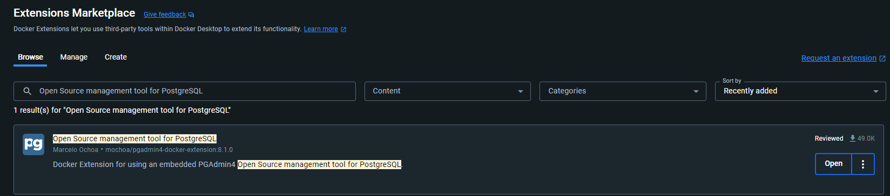
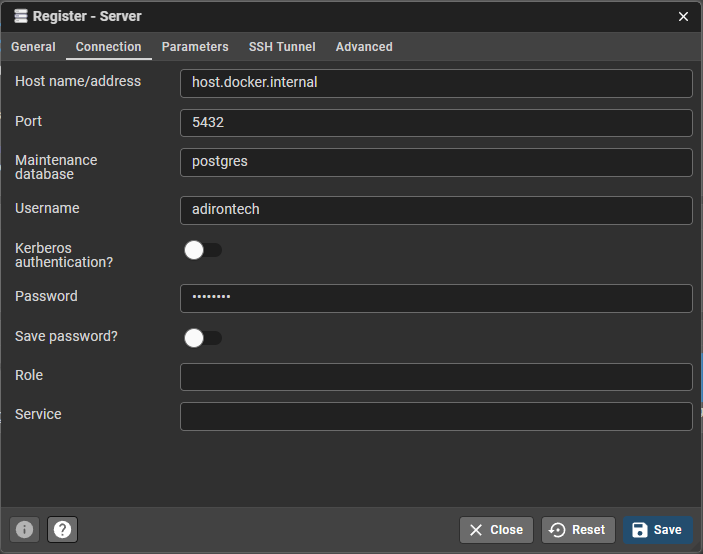

# Adirontech T.R.E.K. Project

The T.R.E.K., Trail Registration Electronic Kiosk, project consists of a react web-app, a kiosk system, and a postgreSQL database for the two. The web-app allows users to pre-register and plan their intended trips to the Adirondack Mountain trails. Trail managers from the Adirondack Wilderness Advocates organization will be able to use the web-app to view aggregate past and current trail usage information.

## Table of Contents

- [Adirontech T.R.E.K. Project](#adirontech-trek-project)
  - [Table of Contents](#table-of-contents)
  - [About](#about)
    - [Web Application](#web-application)
    - [Kiosk System](#kiosk-system)
  - [Project Setup](#project-setup)
    - [For Quick Setup \& Demoing](#for-quick-setup--demoing)
      - [Step 1) Project Prerequisites](#step-1-project-prerequisites)
      - [Step 2) Clone \& Configure Project](#step-2-clone--configure-project)
        - [Environment Variables Setup \& Configuration](#environment-variables-setup--configuration)
      - [Step 3) Quick Start Project / Demo](#step-3-quick-start-project--demo)
    - [For Developers](#for-developers)
      - [Step 1) Project Prerequisites](#step-1-project-prerequisites-1)
      - [Step 2) Clone \& Configure Project](#step-2-clone--configure-project-1)
        - [Environment Variables Setup \& Configuration](#environment-variables-setup--configuration-1)
          - [Quick Starting the Project](#quick-starting-the-project)
      - [Step 3) Setup Docker Database \& PGAdmin4](#step-3-setup-docker-database--pgadmin4)
      - [Step 4) Setup Web \& API Clients](#step-4-setup-web--api-clients)
        - [Setup Web Client](#setup-web-client)
        - [Setup API Client](#setup-api-client)

## About

### Web Application

The web-app allows users to pre-register and plan their intended trips to the Adirondack Mountain trails. Hikers will be able to view the trail districts as well as relevant information about the district and trails they plan on visiting.

Trail managers from the Adirondack Wilderness Advocates organization will be able to use the web-app to view aggregate past and current trail usage information. This will allow them to make accurate decisions when delegating resources to protecting the Adirondack Wilderness.

### Kiosk System

The kiosk system will consist of two different main functions. One will be connected to the internet while the other will be completely remote.

Kiosks connected to the internet will be located at the top of the trailheads. Trailhead kiosks will allow users to check in to their pre-registered trips as well as to register on the spot if they had not done so prior. This data will be sent to the database where trial managers can access.

Remote kiosks will be scattered amongst the trails at junctions and popular areas. These will be equipped with Bluetooth pinging that will count passing by foot traffic of hikers whose Bluetooth is turned on. This data will be downloaded manually from trail managers and then uploaded to the database.

## Project Setup

### For Quick Setup & Demoing

Follow the instructions below to set up the project on your local machine quickly; No developer-specific setup, and a simple way to start up the project as well.

#### Step 1) Project Prerequisites

Ensure the following is installed on your machine:

- Git
  - For instructions for all platforms (Windows, Linux, Mac, & from Source), use this link:
    - <https://github.com/git-guides/install-git>
  - If for some reason the instructions in the bove link don't work, this link's instructions should also work:
    - <https://git-scm.com/book/en/v2/Getting-Started-Installing-Git>
- Node.js
  - <https://nodejs.org/en/download/current>
- Docker + Docker Desktop
  - <https://www.docker.com/get-started/>
- An IDE (code editor) of your choice (VScode is a good recommendation)

Once Docker Desktop is installed, launch it. On the left hand side, navigate to "Extensions", and once you find the Extensions Marketplace, search for `Open Source management tool for PostgreSQL`. Your window should look something like this:

Install this extension; once it is installed, "PGAdmin4" should be a selectable extension on the left-hand side of your Docker Desktop application.

#### Step 2) Clone & Configure Project

On your machine, create a folder directory for the project to be stored in. Copy the path to that directory.

Open a terminal and navigate to the path you copied. Once you have navigated there, run `git clone https://github.com/Adirontech/trek-webapp.git`. The project should be pulled from GitHub to your directory, stored in a single directory called `trek-webapp`.

Once cloned, navigate into the `trek-webapp` directory, and complete the following steps:

##### Environment Variables Setup & Configuration

In the root of the project, create an `.env` file in the root directory of your repository and add the following lines to it:

```text
API_URL=http://localhost/5000
DB_USERNAME=adirontech
DB_PASSWORD=password
DB_PORT=5432
DB_NAME=trek-db
```

<br/><br/>

Environment Variables' Descriptions:

- `API_URL` will determine the URL that the client frontend process will use to communicate with the project's API. For default Demos, this is `http://localhost/5000`.
- `DB_USERNAME` will determine the username you use to access the Docker-hosted Database using pgAdmin 4 later in the setup. For default Demos, this is `adirontech`.
- `DB_PASSWORD` will determine the password you use to access the Docker-hosted Database using pgAdmin 4 later in the setup. For default Demos, this is `password`
- `DB_PORT` will determine the port that the API backend process will use construct & access the URL to the project's database. For default Demos, this is `5432`.
- `DB_NAME` will determine the name of the database that the API backend process will use construct & access the URL to that same database. For default Demos, this is `trek-db`.


#### Step 3) Quick Start Project / Demo

At this point, your project is set up and ready to be run. in your native file explorer or terminal:

- Navigate to the root directory of the project.
- Start up the project using one of the project's demo start files, depending on the type of machine you are using:
  - If you are using a Microsoft Windows machine, double click on/execute `Demo Start (Windows).bat`
  - If you are using an Apple Mac machine, double click on/execute `Demo Start (Mac).sh`

Launching one of the quick start demo files will cause three command terminal windows to open, one for the project's Docker container, one for the backend API, and one for the frontend client. Wait up to a few minutes as each windows installs prerequisite dependencies, and the project will automatically open up in a tab within your computer's default internet browser.

### For Developers

Follow the instructions below to set up the project on your local machine

#### Step 1) Project Prerequisites

Ensure the following is installed on your machine:

- Git
  - For instructions for all platforms (Windows, Linux, Mac, & from Source), use this link:
    - https://github.com/git-guides/install-git
  - If for some reason these instructions don't work, this link's instructions should also work:
    - https://git-scm.com/book/en/v2/Getting-Started-Installing-Git
- Node.js
  - <https://nodejs.org/en/download/current>
- Docker + Docker Desktop
  - <https://www.docker.com/get-started/>
- An IDE (code editor) of your choice (VScode is a good recommendation)

Once Docker Desktop is installed, launch it. On the left hand side, navigate to "Extensions", and once you find the Extensions Marketplace, search for `Open Source management tool for PostgreSQL`. Your window should look something like this:

Install this extension; once it is installed, "PGAdmin4" should be a selectable extension on the left-hand side of your Docker Desktop application.

#### Step 2) Clone & Configure Project

On your machine, create a folder directory for the project to be stored in. Copy the path to that directory.

Open a terminal and navigate to the path you copied. Once you have navigated there, run `git clone https://github.com/Adirontech/trek-webapp.git`. The project should be pulled from GitHub to your directory, stored in a single directory called `trek-webapp`.

Once cloned, navigate into the `trek-webapp` directory, and complete the following steps:

##### Environment Variables Setup & Configuration

In the root of the project, create an `.env` file in the root directory of your repository and add the following lines to it:

```text
API_URL=<your_api_URL_here>
DB_USERNAME=<your_database_username_here>
DB_PASSWORD=<your_database_password_here>
DB_PORT=<your_database_port_here>
DB_NAME=<your_database_name_here>
```

- `API_URL` will determine the URL that the client frontend process will use to communicate with the project's API. By default, replace `<your_api_URL_here>` with `http://localhost/5000`.
- `DB_USERNAME` will determine the username you use to access the Docker-hosted Database using pgAdmin 4 later in the setup. By default, make sure you replace `<your_database_username_here>` with `adirontech`.
- `DB_PASSWORD` will determine the password you use to access the Docker-hosted Database using pgAdmin 4 later in the setup. Make sure you replace `<your_password_here>` with your desired database password (it is your choice).
- `DB_PORT` will determine the port that the API backend process will use construct & access the URL to the project's database. By default, make sure you replace `<your_database_port_here>` with `5432`.
- `DB_NAME` will determine the name of the database that the API backend process will use construct & access the URL to that same database. By default, make sure you replace `<your_database_name_here>` with `trek-db`.

###### Quick Starting the Project

While the developer setup is not yet complete, at this point your project is technically set up and ready to be run. If you wish to check that it works, in your native file explorer or terminal:

- Navigate to the root directory of the project.
- Start up the project using one of the project's demo start files, depending on the type of machine you are using:
  - If you are using a Microsoft Windows machine, double click on/execute `Demo Start (Windows).bat`
  - If you are using an Apple Mac machine, double click on/execute `Demo Start (Mac).sh`

Launching one of the quick start demo files will cause three command terminal windows to open, one for the project's Docker container, one for the backend API, and one for the frontend client (the manual launching of these is coverd below in [Step 3) Setup Docker Database \& PGAdmin4](#step-3-setup-docker-database--pgadmin4) and [Step 4) Setup Web \& API Clients](#step-4-setup-web--api-clients)). Wait up to a few minutes as each windows installs prerequisite dependencies, and the project will automatically open up in a tab within your computer's default internet browser.

#### Step 3) Setup Docker Database & PGAdmin4

With your project is fully-configured, it is time to set up your Docker PostgreSQL Database. First, start a new terminal. In that terminal, navigate to the project directory (`trek-webapp`) in execute the command `docker-compose up` (Note that this is done automatically if the project is started up using one of its Demo Start files). Once you see a message with the LOG statement "database system is ready to acdept connections" in the terminal, your Database is now running.

To connect to the running PostgreSQL container via pgAdmin4, open the PGAdmin4 extension in your docker desktop. Click "Add New Server", and a smaller window will appear. Use it to set the following:

- Under the "General" Tab:
  - Set "Name" to anything you want. This is simply a name for your server for your own reference within Docker Desktop.
- Under the "Connection" Tab:
  - Set "Host name/address" to `host.docker.internal`
  - Set "Port" to `5432`
  - Set "Maintenance database" to `postgres`
  - Set "Username" to `adirontech`
  - Set "Password" to the one you specified in the .env file in Step 1)

Once this is all set, the window should look like this:


Click "Save" in the bottom-right corner of the window. Assuming everything has been set up correctly, no errors should appear, and you are connected to the database!

#### Step 4) Setup Web & API Clients

Once the database docker container is running as shown above, the web client and API client must also be run in separate terminal processes:

##### Setup Web Client

In a new terminal, navigate to the `client` directory and run `npm start`. The web client will start running. (Note that this is done automatically if the project is started up using one of its Demo Start files)

##### Setup API Client

In a new terminal (this will be the third), navigate to the `api` directory and run `npm start`. The API process will default to running on port 5000, while the client process will default to port 3000. (Note that this is done automatically if the project is started up using one of its Demo Start files).
